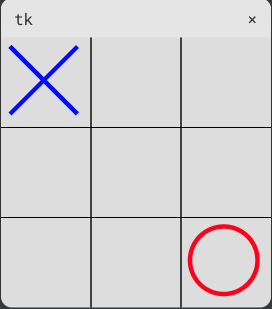

# Tic-Tac-Toe game

## Description
    
- A `Tic-Tac-Toe game` with a windowed interface.
- An object-oriented approach is used to solve the problem.

## Table of Contents 

- [Technology stack](#technology-stack)
- [Installation](#installation)
- [Step by step on the code](#step-by-step-on-the-code)
- [Contributing](#contributing)
- [Contacts](#contacts)


## Technology stack


## Installation

1. Clone the repo
   ```shell
   git clone https://github.com/1vokahsu/Simple-Messenger.git
   ```
2. Run `main.py`

## Step by step on the code
1. First of all, create a class called `TicTacToe`. The `TicTacToe` class must be a descendant of the `Canvas` class from the `tkinter` module. The `__init__` method must be redefined for this class. It must accept the only argument other than `self`. This argument should be called `window`. It is assumed that this will be a `Tk` window object, just like in a normal `Canvas`. Inside the overridden method, there must be a call to the parent method `__init__`. The `window` argument must be passed to it, as well as a width and height equal to 300 pixels. Next, you need to create a `tkinter.Tk` window and an object of the `TicTacToe` class. Name the object of the `TicTacToe` class `game`. Don't forget to pass the window as an argument when creating it. You also need to call the placement method in the `pack` window, and at the very end call the `mainloop` window method. We base our game on the `Canvas` class, get all its features through inheritance and complement the functionality.
```python
import tkinter
from tkinter import Canvas

class TicTacToe(Canvas):
    def __init__(self, window):
        super().__init__(window, width=300, height=300)

window = tkinter.Tk()
game = TicTacToe(window)
game.pack()
window.mainloop()
```
2. Next, you need to add two methods to the `TicTacToe` class. One should be called `add_x`, and the other should be called `add_o`. Each of these methods, in addition to `self`, must have two more arguments — `column` and `row`. This is a column and a row in which you need to draw a cross or a zero. Numbering must start from zero. To make everything look more beautiful, you can draw lines dividing the field into cells. It is desirable to do this in a separate method, which can be called `draw_lines`. To draw lines, use the `create_line` method. Our `TicTacToe` class is a descendant of the `Canvas` class, so inside it methods for drawing shapes can be called via `self`. The size of the cells, as you can easily guess from the size of the canvas, is 100 by 100 pixels. It is not necessary to draw dividing lines to check, so let's go back to the `add_x` and `add_on` methods. The `add_o` method should draw a zero in the desired cell using the `create_oval` method. The width of the zero line can be specified using the named `width` argument, and the color of the line using `outline`.
The `add_x` method should draw a cross using two intersecting lines. The width of the line can be specified using the same named `width` argument as in `create_oval`. The `fill` argument is responsible for the line color. You can choose the colors already on the [page](https://letpy.com/handbook/tkinter-colors/) you are familiar with.
```python
def draw_lines(self):  # drawing the markup
  self.create_line(100, 0, 100, 300, fill='black')
  self.create_line(200, 0, 200, 300, fill='black')
  self.create_line(0, 100, 300, 100, fill='black')
  self.create_line(0, 200, 300, 200, fill='black')

def add_x(self, column, row):  # Drawing 'X'
  self.create_line(10 + (100 * column), 10 + (100 * row),
                   85 + (100 * column), 85 + (100 * row), width=5, fill='blue')
  self.create_line(10 + (100 * column), 85 + (100 * row),
                   85 + (100 * column), 10 + (100 * row), width=5, fill='blue')

def add_o(self, column, row):  # Drawing 'O'
  self.create_oval(10 + (100 * column), 10 + (100 * row),
                   85 + (100 * column), 85 + (100 * row), width=5, outline='red')
```
3. The next step in creating a game is processing the user's progress. To begin with, let's agree that the computer plays for noughts, and the user plays for crosses. In order to store the state of the game, in the `__init__` method, assign the `state` property the value of a list of 9 values `None`. Each of the elements of this list will correspond to a cell of the playing field. The value `None` will indicate that the cell is free. You also need to create a handler method for clicking on the canvas. A handler method, unlike a function, must take two arguments - `self` and `event`. This method should be called `click`. The processing method should be associated with the click event. You need to do this inside the `__init__` method. Remember that our class is the descendant of `Canvas` and we can call all its methods via `self`.
```python
self.bind('<Button-1>', self.click)
```
The following should happen inside the handler method:
* By the coordinates of the click (they can be obtained from the event object), you need to calculate the column and row of the playing field in which the click occurred;
* Using the resulting values, it is necessary to calculate the corresponding index for them in the `state` property;
* Next, if the value of the `state` property in this index is `None`, you need to assign it the string value `"x"`. If the cell is already occupied, the handler method should terminate;
* And in the end, call the `add_x` method with the arguments from the first paragraph to draw a cross in the desired cell of the playing field.
```python
def __init__(self, window):
  super().__init__(window, width=300, height=300)
  self.state = [None] * 9
  self.draw_lines()
  self.bind('<Button-1>', self.click)

def click(self, event):
  column = event.x // 100
  row = event.y // 100
  index = row * 3 + column
  if self.state[index] is None:
      self.state[index] = 'x'
      self.add_x(column, row)
```
4. The next step is to create a bot that will play against us. Add the `bot_move` method to the `TicTacToe` class. This method should do the following:
* select the index of a random free cell from the `state` property;
* assign the `state` value `"o"` in this index;
* call the `add_o` method with the corresponding `column` and `row` arguments.

You also need to add a `bot_move` call in the `click` handler. Immediately after the cross is drawn.
```python
import random

def click(self, event):
  column = event.x // 100
  row = event.y // 100
  index = row * 3 + column
  if self.state[index] is None:
      self.state[index] = 'x'
      self.add_x(column, row)
      # Calling the bot
      self.bot_move()
      
def bot_move(self):
  while True:
      index = random.randrange(9)
      if self.state[index] is None:
          self.state[index] = 'o'
          column = index % 3
          row = index // 3
          self.add_o(column, row)
          break
```
5. To determine the state of the game, you need to write the `get_winner` method. Depending on the state of the playing field `state`, `get_winner` should return the following values:
* the string `'x_win'`, if there are three crosses on the field in one line or diagonally;
* the string `'o_win'`, if there are three zeros on the field in one line or diagonally;
* the line `'draw'` if all the cells are filled, but there is no winner:
* `None`, if there is no winner and there are still free cells.

```python
def isWinner(self, bo, le):
  return ((bo[6] == le and bo[7] == le and bo[8] == le) or
          (bo[3] == le and bo[4] == le and bo[5] == le) or
          (bo[0] == le and bo[1] == le and bo[4] == le) or
          (bo[6] == le and bo[3] == le and bo[0] == le) or
          (bo[7] == le and bo[4] == le and bo[1] == le) or
          (bo[8] == le and bo[5] == le and bo[2] == le) or
          (bo[6] == le and bo[4] == le and bo[2] == le) or
          (bo[8] == le and bo[4] == le and bo[0] == le))

def get_winner(self):  # determine the winner
  board = self.state
  if self.isWinner(board, 'x'):
      return 'x_win'
  elif self.isWinner(board, 'o'):
      return 'o_win'

  # Checking for fullness
  elif None not in self.state:
      return 'draw'

  return None
```
For further convenience, we will also create the `isWinner` method, which will take 2 arguments, in addition to self, `bo` (board) and `le` (letter). And it will only return `TRUE` or `False`, depending on the condition of correct answers.

7. The `get_winner` method written in the last lesson should be called twice inside the `click` method. The first time is after the user's cross is placed. If the function returns something other than `None`, the corresponding inscription about the winner or draw should be displayed on the screen using the `create_text` method. Remember that our `TicTacToe` class is the descendant of the `Canvas` class, so the create_text method must be called via self. If the function returns `None`, the bot must put a zero. To do this, you need to call the `bot_move` method. After that, the `get_winner` function should be called a second time with similar checks for the winner. Yes, after the information about the winner or draw is displayed on the screen, you can pause for a few seconds, overwrite the state of the game with a list of nine `None` and start the game again. To clear the canvas, use the `delete` method with the `"all"` argument. Of course, you need to call it through `self`
```python
import time

def click(self, event):  # processing the user's progress
  column = event.x // 100
  row = event.y // 100
  index = (row * 3) + column
  if self.state[index] == None:
      self.state[index] = 'x'
      self.add_x(column, row)
      winner = self.get_winner()
      if winner != None:
          time.sleep(0.5)
          self.delete('all')
          self.create_text(150, 150, text=winner, font=('Courier', 30))
          time.sleep(1)
          self.delete('all')
          self.state = [None] * 9
          self.draw_lines()
      else:
          move = self.bot_move()
          column = move % 3
          row = move // 3
          self.add_o(column, row)
          self.state[move] = "o"
          winner = self.get_winner()
          if winner != None:
              time.sleep(0.5)
              self.delete('all')
              self.create_text(150, 150, text=winner, font=('Courier', 30))
              time.sleep(1)
              self.delete('all')
              self.state = [None] * 9
              self.draw_lines()
```
8. Let's make the bot smarter. When determining the next move, make a copy of the state of the game and changing this copied state to check which move can lead to victory and which to defeat, using a simple strategy that selects the winning move, if there is one, then goes to the corner, then to the center, then to the edge of the board.
```python
import random

def bot_move(self):  # Bot moving

  possibleMoves = [x for x, letter in enumerate(self.state) if letter == None and x != 'o']
  move = None
  for let in ['o', 'x']:
      for i in possibleMoves:
          boardCopy = self.state[:]
          boardCopy[i] = let
          if self.isWinner(boardCopy, let):
              move = i
              return move

  cornersOpen = []
  for i in possibleMoves:
      if i in [0, 2, 6, 8]:
          cornersOpen.append(i)
  ln = len(cornersOpen)
  if ln > 0:
      r = random.randrange(0, ln)
      move = cornersOpen[r]
      return move

  if 4 in possibleMoves:
      move = 4
      return move

  edgesOpen = []
  for i in possibleMoves:
      if i in [1, 3, 5, 7]:
          edgesOpen.append(i)
  ln = len(edgesOpen)
  if ln > 0:
      r = random.randrange(0, ln)
      move = edgesOpen[r]
      return move
```

## Contributing

Contributions are what make the open source community such an amazing place to learn, inspire, and create. Any contributions you make are **greatly appreciated**.

If you have a suggestion that would make this better, please fork the repo and create a pull request. You can also simply open an issue with the tag "enhancement".
Don't forget to give the project a star! Thanks again!

1. Fork the Project
2. Create your Feature Branch (`git checkout -b feature/AmazingFeature`)
3. Commit your Changes (`git commit -m 'Add some AmazingFeature'`)
4. Push to the Branch (`git push origin feature/AmazingFeature`)
5. Open a Pull Request

## Contacts

[](https://t.me/svokahsu)
[](https://github.com/1vokahsu)